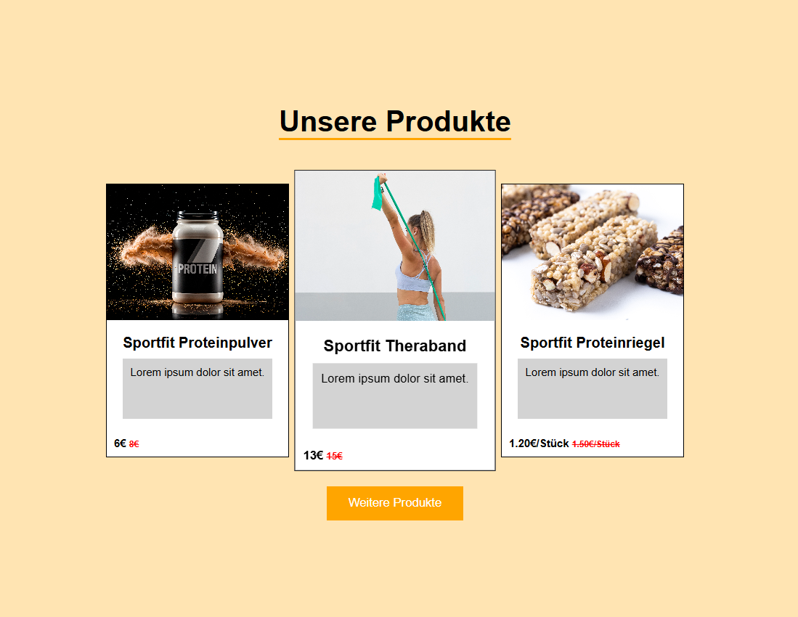

# **Online-Shop**

Ausschließlich visuelle Umsetzung einer Produktübersicht für einen fiktiven Fitness-Online-Shop. Das Ziel dieses Projekts ist die Demonstration einer sauberen CSS-Architektur durch Anwendung der BEM-Methodik (Block, Element, Modifier). Das Projekt nutzt den Build-Server Vite zur Kompilierung des SCSS-Quellcodes in reguläres CSS.

## Voraussetzungen
Für die lokale Entwicklung wird eine Laufzeitumgebung benötigt:
- Node.js (Version 18 oder höher empfohlen)
- npm (wird automatisch mit Node.js installiert)
- Ein moderner Webbrowser zur Darstellung des lokalen Entwicklungsservers

## Technologien
- HTML5: Bereitstellung der semantischen Grundstruktur für die Produktkarten.
- SCSS: Nutzung von fortgeschrittenen Stylesheet-Funktionen wie Selektor-Verschachtelung (Nesting) und der Referenzierung des Eltern-Selektors via Amperand-Zeichen (`&`).
- BEM-Methodik: Strukturierung des Codes in die Blöcke `main-container` und `product`, um Kaskadierungsprobleme zu vermeiden und die Wiederverwendbarkeit zu maximieren.
- Vite: Verwendung als performanter Bundler und Entwicklungsserver für das automatische Neuladen bei Code-Änderungen (Hot Module Replacement).

## Installation
Klonen Sie das Repository und installieren Sie die erforderlichen Abhängigkeiten über das Terminal:

1. Repository klonen:
```bash
git clone https://github.com
```

2. In das Projektverzeichnis wechseln:
```bash
cd IHR-REPOSITORY-NAME
```

3. Abhängigkeiten über den Node Package Manager installieren:
```bash
npm install
```

## Nutzung
Nach der erfolgreichen Installation stehen Ihnen folgende Skripte zur Verfügung:

1. Lokalen Entwicklungsserver starten:
```bash
npm run dev
```
Öffnen Sie anschließend die im Terminal angezeigte lokale Adresse (standardmäßig `http://localhost:5173`) in Ihrem Webbrowser.

2. Produktionsbereites Build erstellen:
```bash
npm run build
```
Vite kompiliert den SCSS-Code in optimiertes, minifiziertes CSS und legt die finalen Dateien im Verzeichnis `dist` ab.

## Deployment
Das Projekt kann nach der Kompilierung auf Plattformen wie GitHub Pages, Vercel oder Netlify gehostet werden. Für das Deployment von Vite-Projekten auf GitHub Pages muss der Build-Befehl automatisiert über eine GitHub Action ausgeführt werden, welche das Verzeichnis `dist` als Quelle für die Veröffentlichung nutzt.
